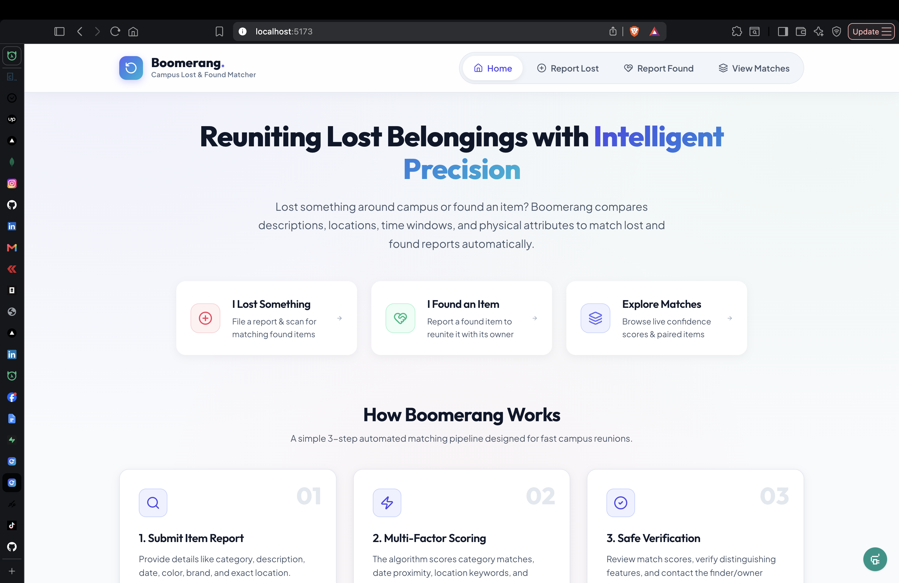
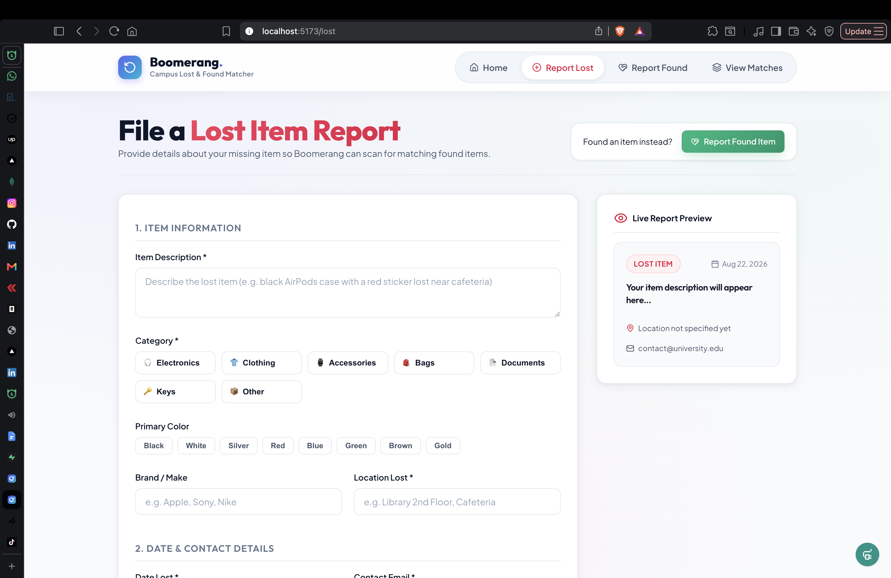
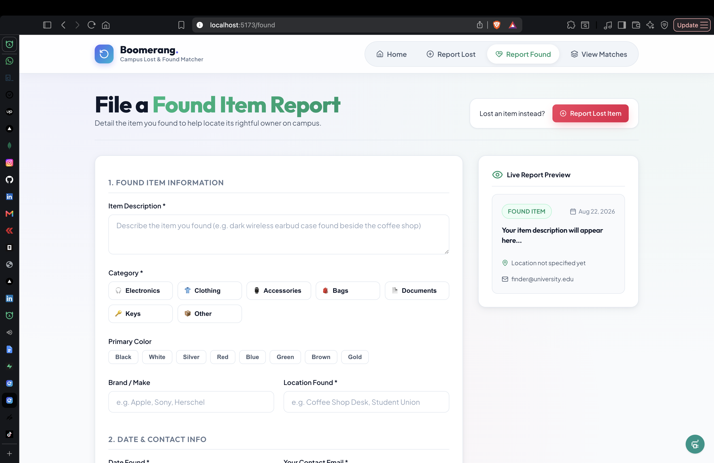
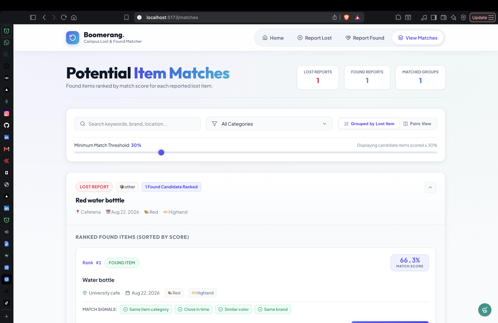

# Boomerang — Campus Lost & Found Matcher

A Vue.js application that identifies potential matches between lost and found item reports at a university using a multi-factor weighted scoring algorithm.

## Screenshots

### Home Page


### Report Lost Item


### Report Found Item


### Matches View


---

## Approach

### Problem Analysis

The core challenge is matching free-text descriptions of lost and found items when there's no precise definition of a "match." A student might report "lost black AirPods near cafeteria" while another reports "found dark wireless earbud case by coffee shop" — these should be identified as potential matches.

I approached this as a **multi-factor similarity search problem** where each report is compared across multiple dimensions to calculate a confidence score.

### Solution Design

I implemented a **weighted scoring system** that considers 6 factors:

1. **Category** (30% weight) — Is it the same type of item?
2. **Location** (25% weight) — Were they lost/found in similar places?
3. **Time** (20% weight) — How close in time were the events?
4. **Description** (15% weight) — Do the descriptions share keywords?
5. **Color** (5% weight) — Are the colors similar?
6. **Brand** (5% weight) — Is it the same brand?

Each factor produces a score from 0-1, which is multiplied by its weight and summed to produce a final match confidence score (0-100%).

---

## Important Assumptions

1. **Category is most important** — Matching a lost phone with a found phone matters more than matching locations. Hence 30% weight.

2. **Location fuzzy matching** — "Library 2nd floor" and "Library entrance" should be considered similar since they share the same building.

3. **Temporal decay** — Items lost/found within days are much more likely to match than weeks apart. I used exponential decay with a half-life of ~5 days.

4. **Color families** — "Black," "charcoal," and "dark" should be considered similar colors.

5. **Missing data is neutral** — If color or brand isn't provided, it doesn't hurt the score (0.5 neutral instead of 0).

6. **University campus context** — Locations like "library," "cafeteria," "gym" are common and should be recognized as similar when appearing in both reports.

---

## How the Matching System Works

### Algorithm Details

The matching algorithm in `src/utils/matching.ts` works as follows:

```
For each lost item:
  For each found item:
    1. Calculate category score (exact match: 1, else: 0)
    2. Calculate location score (fuzzy matching with keyword detection)
    3. Calculate temporal score (exponential decay over 30 days)
    4. Calculate description score (Jaccard keyword similarity)
    5. Calculate color score (exact match or color family)
    6. Calculate brand score (string similarity)
    
    finalScore = Σ(factorScore × weight) × 100
    
    if finalScore >= threshold:
      Add to matches with explanation reasons
```

### Scoring Factors

| Factor | Weight | Score Range | Logic |
|--------|--------|-------------|-------|
| Category | 30% | 0 or 1 | Exact match only |
| Location | 25% | 0 - 1 | Exact (1.0), contains (0.8), common words (0.6), fuzzy (0-0.5) |
| Time | 20% | 0 - 1 | Exponential decay: e^(-days/7), half-life ~5 days |
| Description | 15% | 0 - 1 | Jaccard similarity of word sets (filters words < 3 chars) |
| Color | 5% | 0.2 - 1 | Exact (1.0), family (0.7), different (0.2), missing (0.5) |
| Brand | 5% | 0 - 1 | String similarity via Levenshtein distance |

### Match Threshold

Users can adjust the minimum match score via a slider (default: 30%). Only matches above this threshold are displayed.

### Match Explanations

Each match includes human-readable reasons:
- "Same item category"
- "Similar location"
- "Close in time"
- "Similar description"
- "Similar color"
- "Same brand"

---

## What I Intentionally Chose NOT to Build

1. **User authentication** — Not required for the assessment scope. Could be added for tracking personal reports.

2. **Image uploads** — Would require storage solution and visual similarity算法, significantly increasing complexity.

3. **Real-time notifications** — Supabase supports this, but not essential for MVP.

4. **Admin dashboard** — The assessment focuses on user-facing functionality.

5. **Geolocation/map integration** — Would add significant complexity for location selection.

6. **Email notifications** — Would require email service integration.

7. **Duplicate report detection** — Could prevent the same item from being reported multiple times.

8. **Pagination/infinite scroll** — Current implementation loads all matches; fine for campus scale.

---

## What I Would Improve With More Time

### Short-term (1-2 days)
- **Image support** — Allow photo uploads for visual matching
- **Improved matching** — Add synonyms (e.g., "earbuds" = "earphones")
- **Date/time pickers** — Better UX for selecting when item was lost/found
- **Form persistence** — Save draft if user accidentally navigates away

### Medium-term (1 week)
- **Semantic search** — Use embeddings (OpenAI/Cohere) for better description matching
- **User accounts** — Let users track their reports and matches
- **Notifications** — Email/push when new matches appear
- **Advanced filtering** — Filter by date range, location, category

### Long-term (1 month)
- **Mobile app** — Native iOS/Android for better photo capture
- **Admin dashboard** — For university staff to manage reports
- **Analytics** — Track match success rates and improve algorithm
- **Campus integration** — SSO with university authentication
- **Multi-language support** — For international students

---

## Code Analysis Against Specification

### Requirement 1: Create lost-item reports ✅

**File:** `src/views/LostReportView.vue`

**Implementation:**
- Form with fields: description, category, color, brand, location, date, email, phone, notes
- Client-side validation (required fields, email format)
- Supabase integration for persistence
- Success feedback and redirect to matches

**Specification compliance:**
- ✅ Users can describe their lost item
- ✅ Form captures relevant metadata
- ✅ Input validation prevents incomplete reports
- ✅ Clear feedback on submission

### Requirement 2: Create found-item reports ✅

**File:** `src/views/FoundReportView.vue`

**Implementation:**
- Mirror of lost form with appropriate field names
- Same validation and persistence logic
- Category chips and color swatches for better UX

**Specification compliance:**
- ✅ Users can describe found items
- ✅ Consistent UX with lost form
- ✅ All necessary metadata captured

### Requirement 3: See potential matches ✅

**File:** `src/views/MatchesView.vue`

**Implementation:**
- Fetches all lost and found items from Supabase
- Runs matching algorithm client-side
- Displays matches sorted by score
- Adjustable threshold slider
- Grouped view (lost item → ranked found items)
- Detailed match cards with reasons
- Modal for contacting match

**Specification compliance:**
- ✅ Matches are displayed with confidence scores
- ✅ Users can adjust match sensitivity
- ✅ Clear explanation of why items match
- ✅ Contact information available

### Requirement 4: Handle incorrect/incomplete input ✅

**Implementation:**
- Form validation prevents empty required fields
- Email format validation
- Neutral scoring for missing optional fields
- Error messages for failed submissions

**Specification compliance:**
- ✅ Incomplete forms are rejected with clear messages
- ✅ Missing optional data doesn't break matching
- ✅ System errors are handled gracefully

### Requirement 5: Make thoughtful decisions ✅

**Evidence:**
- Multi-factor weighted scoring (not just keyword matching)
- Exponential decay for temporal relevance
- Color family grouping (black/charcoal/navy)
- Fuzzy location matching
- Adjustable threshold for user control
- Match explanations for transparency

---

## Live Demo

🔗 **[https://boomerangs.vercel.app](https://boomerangs.vercel.app)**

---

## Local Development (Optional)

If you want to run the project locally:

### Prerequisites
- Node.js 18+
- A Supabase project (free tier works)

### 1. Clone and install
```bash
git clone https://github.com/your-username/boomerang-matcher.git
cd boomerang-matcher
npm install
```

### 2. Configure Supabase
1. Create a new project at [supabase.com](https://supabase.com)
2. Go to **Settings → API** and copy:
   - Project URL
   - Anon/public key
3. Create `.env` file:
```env
VITE_SUPABASE_URL=your_supabase_url
VITE_SUPABASE_ANON_KEY=your_anon_key
```

### 3. Set up database
1. Go to **SQL Editor** in Supabase dashboard
2. Copy contents of `supabase/migrations/001_initial_schema.sql`
3. Click **Run**

### 4. Run the application
```bash
npm run dev
```

The app will be available at `http://localhost:5173`

### 5. Deploy to Vercel (optional)
```bash
npm i -g vercel
vercel login
vercel
```

---

## Tech Stack

- **Frontend:** Vue.js 3, TypeScript, Vite
- **Styling:** CSS with glassmorphism design
- **Icons:** Lucide Vue
- **Database:** Supabase (PostgreSQL)
- **Deployment:** Vercel

---

## AI Usage Disclosure

I used **OpenCode Mimo v2.5** throughout development to:

- Explain algorithms like Levenshtein distance and Jaccard similarity
- Help structure the matching logic and weighted scoring approach
- Generate initial project scaffolding and type definitions
- Write this README and analyze code against the specification

The matching algorithm weights and overall approach were designed manually based on the problem requirements.

---

## License

This project was created as a software engineering assessment submission.